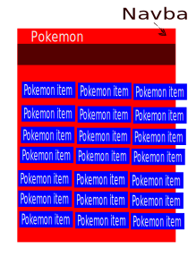
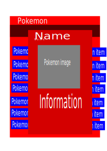
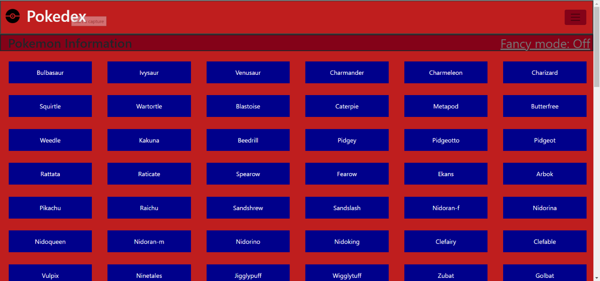
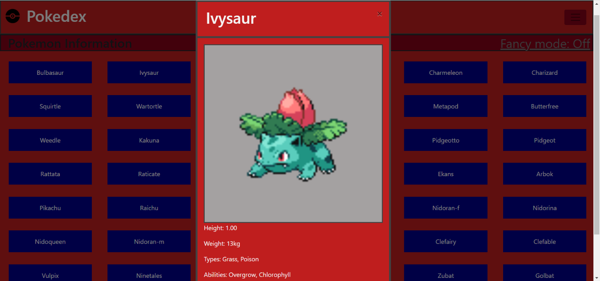
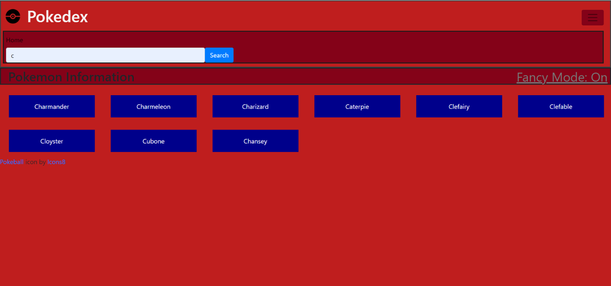
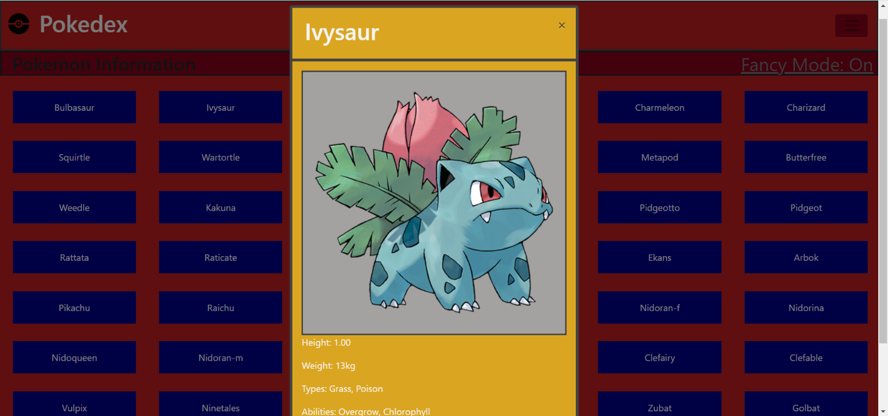

# Pokedex
## Description of project
A web application created using HTML, CSS, and JavaScript, that pulls and then loads data from an external API, displaying specific data points for each entity in detail.
## How to use application
* Load the data from the public API
* View the pulled data displayed as part of a list
* Either select data view generated buttons or search for a specific item via the drop down search
## API used
https://pokeapi.co/api/v2/pokemon/?limit=151

## Technologies
HTML, CSS, and JavaScript
## Libraries
JQuery, BootStrap, Fetch and Promise Polyfills

## Sketch

## Final site
This is the final look of the application. When you click on a pokemon button, it opens a modal displaying an image and the details of the pokemon.

You can search by name for pokemon in the search bar located in the navbar dropdown. If an single match is found, then a modal for the pokemon is opened. If multiple matchs are found then the list is loaded onto the page. If none are found then a modal opens to tell you no results found.

The button "fancy mode" changes coloring of the modals when opened and switchs from the sprite to the offical artwork for each pokemon, since they are larger image files, this can be a slowing experience for users.
